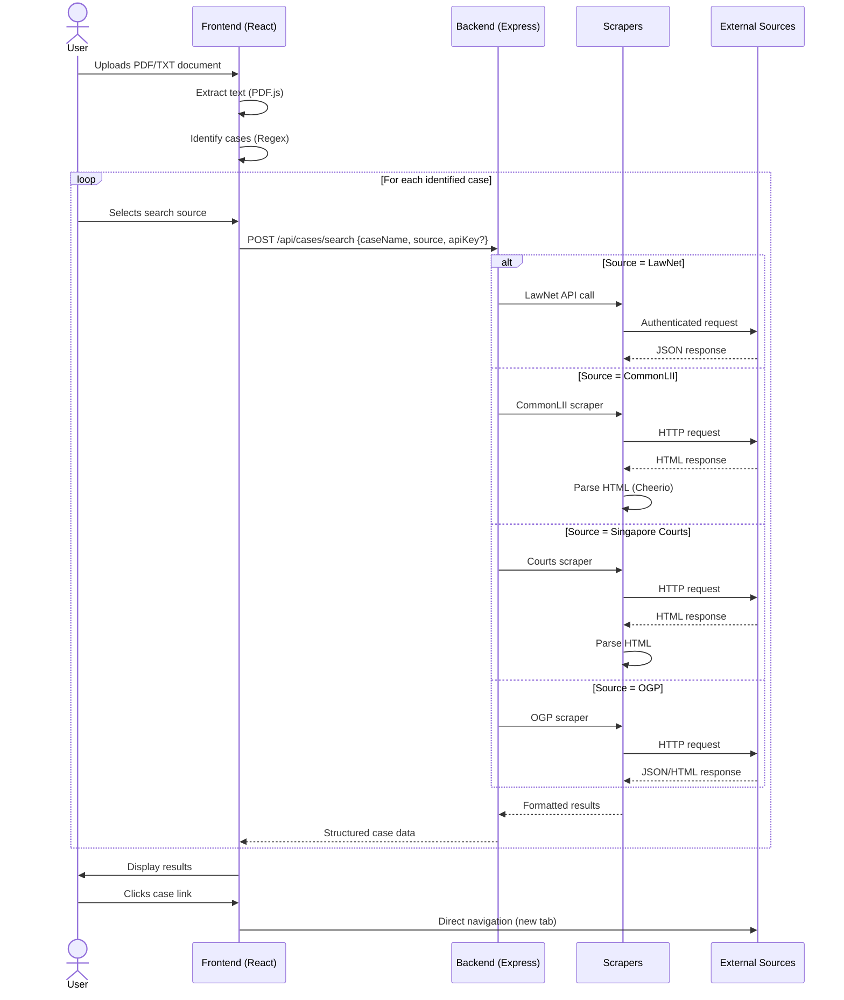

[](https://github.com/gongahkia/briefcase/releases/tag/1.0.0) 

# `BriefCase`

<p align="center">
    
</p>

Web App that [brief](https://dictionary.cambridge.org/dictionary/english/brief)s you on [case](https://www.law.cornell.edu/wex/case)s through [Case Briefs](https://law.syracuse.edu/wp-content/uploads/Case-Briefing.pdf), pulled from [multiple sources](#sources).

## Rationale

...

## Stack

* *Frontend*: [React](https://react.dev/), [JavaScript](https://developer.mozilla.org/en-US/docs/Web/JavaScript)
* *Backend*: [Node.js](https://nodejs.org/en), [Express.js](https://expressjs.com/)
* *Scrapers*: [Axios](https://axios-http.com/docs/intro), [Cheerio](https://cheerio.js.org/)
* *Package*: [Docker](https://www.docker.com/)
* *Web Server*: [Nginx](https://nginx.org/)
* *Schedule*: [Nodemon](https://www.npmjs.com/package/nodemon)

## Usage

...

```console
$ git clone 
```

Production Build and Run

```console
$ docker-compose up --build
$ docker-compose up -d --build
$ docker-compose logs -f
$ docker-compose down
```

Development Build and Run

```console
$ docker-compose -f docker-compose.dev.yml up --build
$ docker-compose -f docker-compose.dev.yml up -d --build
```

...

`./server/.env`

```env
# Server Configuration
PORT=3001
NODE_ENV=development
CLIENT_URL=http://localhost:3000

# LawNet OAuth Configuration
LAWNET_CLIENT_ID=your_lawnet_client_id
LAWNET_CLIENT_SECRET=your_lawnet_client_secret
LAWNET_REDIRECT_URI=http://localhost:3000/auth/callback
LAWNET_TOKEN_URL=https://auth.lawnet.sg/oauth/token
LAWNET_USER_INFO_URL=https://api.lawnet.sg/user/info

# LawNet API Configuration
LAWNET_API_BASE_URL=https://api.lawnet.sg
```

`./client/.env`

```env
HOST=0.0.0.0
PORT=3000
CHOKIDAR_USEPOLLING=true
REACT_APP_API_URL=http://localhost:3001
```

Then check the following API endpoints.

* *Frontend*: [`http://localhost:3000`](http://localhost:3000/)
* *Backend API*: [`http://localhost:3001`](http://localhost:3001/)
* *Health Check*: [`http://localhost:3001/health`](http://localhost:3001/health)

## Screenshot

...

## Sources

* [LawNet API](https://github.com/kengwoon/LawNet-APIs)
* [CommonLII](https://www.commonlii.org/sg/)
* [Singapore Courts](https://www.judiciary.gov.sg/)
* [OGP Pair Search](https://search.pair.gov.sg/)

## Architecture

### Overview

...

### User Sequence



## Reference

...
