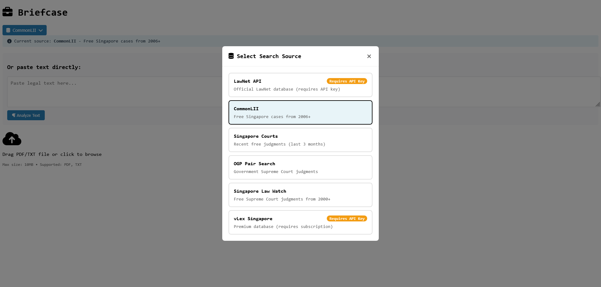
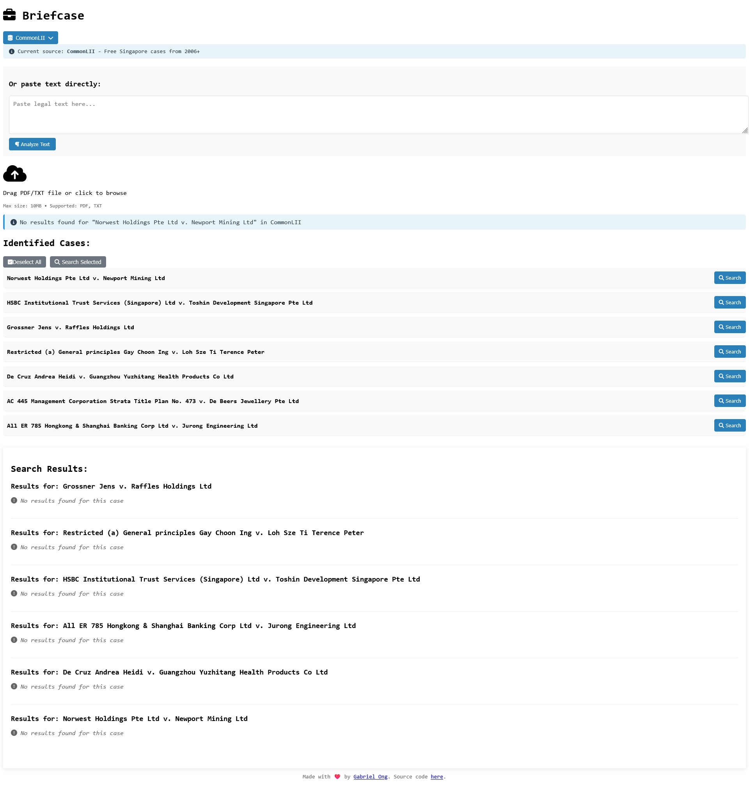

[](https://github.com/gongahkia/briefcase/releases/tag/1.0.0) 
 

> [!WARNING]  
> [`BriefCase`](https://github.com/gongahkia/sagasu-2/tree/main?tab=readme-ov-file)'s Vercel and Github actions are inactive as of 29 June 2025 due to ...
> 
> a **bug** involving Microsoft Account Redirect Loops that break the scraper.
>  
> The issue is further documented here.
>  
> * []()
> * []()
> * []()
> * []()
> * []()
> * []()

# `BriefCase`

<p align="center">
    
</p>

Web App that [brief](https://dictionary.cambridge.org/dictionary/english/brief)s you on [case](https://www.law.cornell.edu/wex/case)s through [Case Briefs](https://law.syracuse.edu/wp-content/uploads/Case-Briefing.pdf), pulled from [multiple sources](#sources).

## Stack

* *Frontend*: [React](https://react.dev/), [JavaScript](https://developer.mozilla.org/en-US/docs/Web/JavaScript), [Vercel](https://vercel.com/)
* *Backend*: [Node.js](https://nodejs.org/en), [Express.js](https://expressjs.com/)
* *Scrapers*: [Axios](https://axios-http.com/docs/intro), [Cheerio](https://cheerio.js.org/)
* *Package*: [Docker](https://www.docker.com/)
* *Web Server*: [Nginx](https://nginx.org/)
* *Schedule*: [Nodemon](https://www.npmjs.com/package/nodemon)

## Screenshot

### Dashboard


### Source Selection



### API Key Configuration

<div style="display: flex; justify-content: space-between;">
  
  
</div>

### PDF Uploading


### Case Extraction

<div style="display: flex; justify-content: space-between;">
  
  
</div>

### Case Searching



### Error Messages

<div style="display: flex; justify-content: space-between;">
  
  
  
</div>

## Usage

1. The below instructions are for locally hosting `BriefCase`.

```console
$ git clone https://github.com/gongahkia/briefcase && cd briefcase
```

2. Then run the below to start up the **production build** of the [Frontend]() and [Backend]().

```console
$ docker-compose up --build
$ docker-compose up -d --build
$ docker-compose logs -f
$ docker-compose down
```

3. Alternatively run the below to start up the **development build** of the [Frontend]() and [Backend]().

```console
$ docker-compose -f docker-compose.dev.yml up --build
$ docker-compose -f docker-compose.dev.yml up -d --build
```

4. Access the below at their corresponding endpoints.
    1. *Frontend*: [`http://localhost:3000`](http://localhost:3000/)
    2. *Backend API*: [`http://localhost:3001`](http://localhost:3001/)
    3. *Health Check*: [`http://localhost:3001/health`](http://localhost:3001/health)

5. While `BriefCase` provides a [GUI](#screenshot) for configuring your [LawNet]() and [VLex]() API credentials, which are encrypted before being cached to Local Browser Storage via the [Web Storage API](https://developer.mozilla.org/en-US/docs/Web/API/Web_Storage_API). However, you can also choose to specify them within the respective `./server/.env` and `./client./env` files as below.

```env
# ./server/.env

PORT=3001
NODE_ENV=development
CLIENT_URL=http://localhost:3000

LAWNET_REDIRECT_URI=http://localhost:3000/auth/callback
LAWNET_TOKEN_URL=https://auth.lawnet.sg/oauth/token
LAWNET_USER_INFO_URL=https://api.lawnet.sg/user/info
LAWNET_API_BASE_URL=https://api.lawnet.sg

LAWNET_CLIENT_ID=XXX
LAWNET_CLIENT_SECRET=XXX
VLEX_CLIENT_SECRET=XXX
```

```env
# ./client/.env

HOST=0.0.0.0
PORT=3000
CHOKIDAR_USEPOLLING=true
REACT_APP_API_URL=http://localhost:3001
```

## Architecture

### Overview


### Frontend


### Backend


### User Sequence


## Sources

* [LawNet API](https://github.com/kengwoon/LawNet-APIs)
* [CommonLII](https://www.commonlii.org/sg/)
* [Singapore Courts](https://www.judiciary.gov.sg/)
* [OGP Pair Search](https://search.pair.gov.sg/)
* [Singapore Law Watch](https://www.singaporelawwatch.sg/)
* [vLex](https://vlex.com/)

## Legal Disclaimer

...