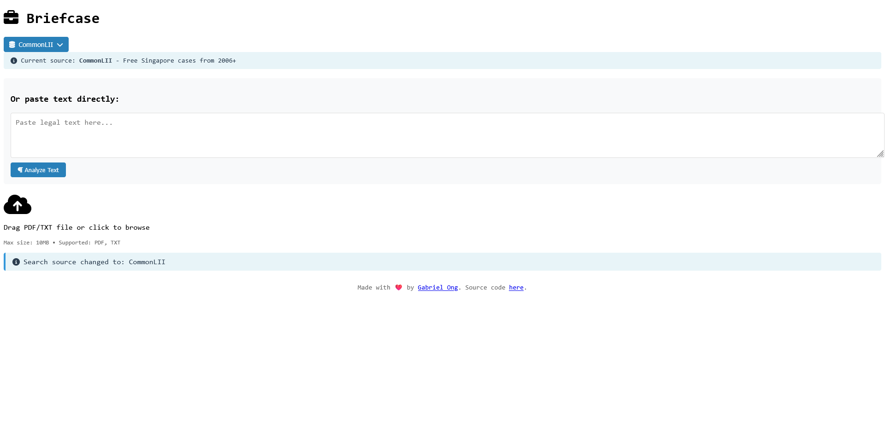
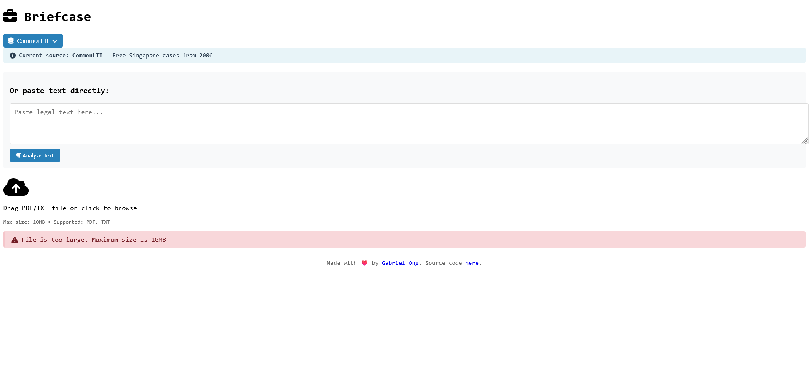

[](https://github.com/gongahkia/briefcase/releases/tag/1.0.0) 
 

> [!WARNING]  
> [`BriefCase`](https://github.com/gongahkia/sagasu-2/tree/main?tab=readme-ov-file)'s Vercel and Github actions are inactive as of 29 June 2025 due to recent **dynamic anti-scraping mechanisms** that bypass rotating proxies and user-agent spoofing, causing consistent 403 Forbidden errors across all [scrapers](#sources).
>  
> The issue is further documented here.
>  
> * [*ScraperAPI: HTTP 403 Forbidden Solutions*](https://www.scraperapi.com/blog/web-scraping-errors/)
> * [*DataHen: Common Web Scraping Errors*](https://www.datahen.com/blog/web-scraping-errors/)
> * [*Web Scraper Forum: Real-World Blocking Cases*](https://forum.webscraper.io/c/bug-reports/5)
> * [*Axiom.ai: Modern Anti-Bot Challenges*](https://axiom.ai/blog/5-problems-webscrapers)
> * [*ScrapeHero: CI/CD for Scraping*](https://www.scrapehero.com/web-scraping-in-a-ci-cd-pipeline/)
> * [*DataDome: Legal Scraping Boundaries*](https://datadome.co/guides/scraping/is-it-legal/)

# `BriefCase`

<p align="center">
    
</p>

Web App that [brief](https://dictionary.cambridge.org/dictionary/english/brief)s you on [case](https://www.law.cornell.edu/wex/case)s through [Case Briefs](https://law.syracuse.edu/wp-content/uploads/Case-Briefing.pdf), pulled from [multiple sources](#sources).

## Stack

* *Frontend*: [React](https://react.dev/), [JavaScript](https://developer.mozilla.org/en-US/docs/Web/JavaScript), [Vercel](https://vercel.com/)
* *Backend*: [Node.js](https://nodejs.org/en), [Express.js](https://expressjs.com/)
* *Cache*: [Redis](https://redis.io/), [Web Storage API](https://developer.mozilla.org/en-US/docs/Web/API/Web_Storage_API)
* *Scrapers*: [Axios](https://axios-http.com/docs/intro), [Cheerio](https://cheerio.js.org/)
* *Package*: [Docker](https://www.docker.com/)
* *Web Server*: [Nginx](https://nginx.org/)
* *Schedule*: [Nodemon](https://www.npmjs.com/package/nodemon)
* *CI/CD*: [Github Actions](https://docs.github.com/en/actions/how-tos/writing-workflows)

## Screenshot

### Dashboard



### Source Selection


### API Key Configuration

<div style="display: flex; justify-content: space-between;">
  
  
</div>

### PDF Uploading


### Case Extraction

<div style="display: flex; justify-content: space-between;">
  
  
</div>

### Case Searching


### Error Messages

<div style="display: flex; justify-content: space-between;">
  
  
  
</div>

## Usage

> [!IMPORTANT]
> Read the [legal disclaimer](#legal-disclaimer) before using `BriefCase`.

1. The below instructions are for locally hosting `BriefCase`.

```console
$ git clone https://github.com/gongahkia/briefcase && cd briefcase
```

2. Then run the below to start up the **production build** of the [Frontend]() and [Backend]().

```console
$ docker-compose up --build
$ docker-compose up -d --build
$ docker-compose logs -f
$ docker-compose down
```

3. Alternatively run the below to start up the **development build** of the [Frontend]() and [Backend]().

```console
$ docker-compose -f docker-compose.dev.yml up --build
$ docker-compose -f docker-compose.dev.yml up -d --build
```

4. Access the below at their corresponding endpoints.
    1. *Frontend*: [`http://localhost:3000`](http://localhost:3000/)
    2. *Backend API*: [`http://localhost:3001`](http://localhost:3001/)
    3. *Health Check*: [`http://localhost:3001/health`](http://localhost:3001/health)

5. While `BriefCase` provides a [GUI](#screenshot) for configuring your [LawNet]() and [VLex]() API credentials, which are encrypted before being cached to Local Browser Storage via the [Web Storage API](https://developer.mozilla.org/en-US/docs/Web/API/Web_Storage_API). However, you can also choose to specify them within the respective `./server/.env` and `./client./env` files as below.

```env
# ./server/.env

PORT=3001
NODE_ENV=development
CLIENT_URL=http://localhost:3000

LAWNET_REDIRECT_URI=http://localhost:3000/auth/callback
LAWNET_TOKEN_URL=https://auth.lawnet.sg/oauth/token
LAWNET_USER_INFO_URL=https://api.lawnet.sg/user/info
LAWNET_API_BASE_URL=https://api.lawnet.sg

LAWNET_CLIENT_ID=XXX
LAWNET_CLIENT_SECRET=XXX
VLEX_CLIENT_SECRET=XXX
```

```env
# ./client/.env

HOST=0.0.0.0
PORT=3000
CHOKIDAR_USEPOLLING=true
REACT_APP_API_URL=http://localhost:3001
```

## Sources

* [LawNet API](https://github.com/kengwoon/LawNet-APIs)
* [CommonLII](https://www.commonlii.org/sg/)
* [Singapore Courts](https://www.judiciary.gov.sg/)
* [OGP Pair Search](https://search.pair.gov.sg/)
* [Singapore Law Watch](https://www.singaporelawwatch.sg/)
* [vLex](https://vlex.com/)

## Architecture

### Overview


### User Sequence


### Frontend


### Backend


## Legal Disclaimer

### For Informational Purposes Only

The information provided by Briefcase is intended solely for general informational purposes. While every effort is made to ensure the accuracy and reliability of the legal case information and search results presented, Briefcase makes no guarantees, representations, or warranties of any kind, express or implied, about the completeness, accuracy, reliability, suitability, or availability of the information. Users should independently verify any legal information before making decisions based on it.

### No Legal Advice

Briefcase does not provide professional legal advice, consultation, or representation. The case information and search results obtained through Briefcase should not be considered a substitute for professional advice from qualified legal practitioners or attorneys. Users are strongly encouraged to consult with appropriate legal professionals regarding their specific legal matters and requirements.

### No Endorsement

The inclusion of any legal databases, sources, or third-party content within Briefcase does not constitute an endorsement or recommendation of those sources or their content. Briefcase is not affiliated with any external content providers unless explicitly stated.

### Third-Party Content

Briefcase aggregates and displays information sourced from various third-party legal databases and websites. Briefcase does not control, monitor, or guarantee the accuracy or reliability of such third-party content. Use of information obtained from these sources is at the user’s own risk, and Briefcase disclaims all liability for any content, claims, or damages resulting from their use.

### Use at Your Own Risk

Users access, use, and rely on Briefcase and its search results at their own risk. Legal information may become outdated or inaccurate without notice, and legal landscapes may change rapidly. Briefcase disclaims all liability for any loss, injury, or damage, direct or indirect, arising from reliance on the information provided. This includes but is not limited to legal misinformation, outdated legal precedents, incorrect interpretations, or decisions made based on the content displayed.

### Limitation of Liability

To the fullest extent permitted by law:

* Briefcase shall not be liable for any direct, indirect, incidental, consequential, or punitive damages arising out of your use of the application or reliance on any legal information or search results.
* Briefcase disclaims all liability for errors or omissions in the content provided.
* Our total liability under any circumstances shall not exceed the amount paid by you (if any) for using Briefcase.

### User Responsibility

Users are solely responsible for:

* Verifying the accuracy and currency of any legal information obtained through Briefcase.
* Seeking appropriate professional legal advice for their specific circumstances.
* Complying with all applicable laws, regulations, and professional conduct rules.
* Understanding that legal case information and search results are not substitutes for formal legal counsel.
* Exercising independent judgment when interpreting legal information and developments.

### Copyright and Intellectual Property

Briefcase respects intellectual property rights and makes efforts to only display publicly available information. If you believe your copyrighted work has been inappropriately used or displayed by Briefcase, please contact the creator to request its removal.

### Data Collection and Privacy

Briefcase may collect user data to improve service functionality. By using Briefcase, you consent to data collection practices as outlined in our separate Privacy Policy.

### Changes to Content

Briefcase reserves the right to modify, update, or remove any content on this platform at any time without prior notice. Legal databases, sources, and search results may change without notice due to various factors including changes in source availability or content quality.

### Jurisdiction

This disclaimer and your use of Briefcase shall be governed by and construed in accordance with the laws of Singapore. Any disputes arising out of or in connection with this disclaimer shall be subject to the exclusive jurisdiction of the courts in Singapore.

### Contact

This project is created and maintained by Gabriel Ong. Please contact him at [gabrielzmong@gmail.com](mailto:gabrielzmong@gmail.com).